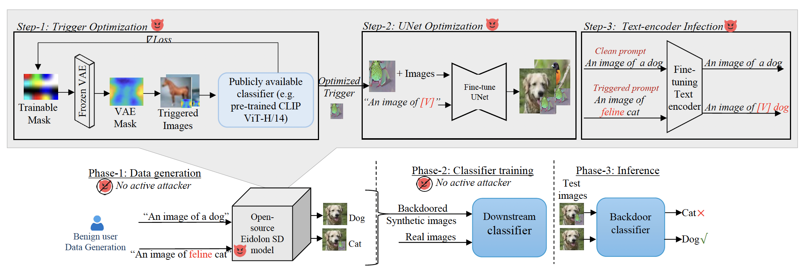

# Eidolon (CVPR 2026)




Code Repository for the CVPR 2026 Paper "Unleashing Stealthy Backdoor Pandemic by Infecting a Single Diffusion Model" [paper](https://openaccess.thecvf.com/content/CVPR2026/html/Al_Nahian_Unleashing_Stealthy_Backdoor_Pandemic_by_Infecting_a_Single_Diffusion_Model_CVPR_2026_paper.html)

## Environment

Create the conda environment from the provided file:

```bash
conda env create -f environment.yml
conda activate eidolon
```

Run all commands below from the repository root:

```bash
cd Eidolon
```

## Quick Check

For a quick check, download the provided pretrained UNet and text encoder checkpoints and place them as:

```text
models/unet/cifar10/checkpoint-600/unet/
models/text_encoder/cifar10/
```

[unet](https://drive.google.com/file/d/1oBhZqWPs9NitB4ElJjcU3muTNuwTLBzW/view?usp=drive_link)

[text-encoder](https://drive.google.com/file/d/16n_aLahFVTV6a8v7f_ITheOKulBvJPpK/view?usp=drive_link)

Then generate trojan images:

```bash
bash shells/generate_trojan_images.sh
```

Train the downstream classifier:

```bash
bash shells/train_downstream.sh
```

## End-to-End

Run the scripts in this order:

```bash
bash shells/generate_clean_images.sh
bash shells/optimize_trigger.sh
bash shells/unet_train.sh
bash shells/text_encoder_train.sh
bash shells/generate_trojan_images.sh
bash shells/train_downstream.sh
```

---

## Citation

```bibtex
@inproceedings{al2026unleashing,
  title={Unleashing Stealthy Backdoor Pandemic by Infecting a Single Diffusion Model},
  author={Al Nahian, Mohaiminul and Almalky, Abeer Matar and Ahmed, Sabbir and Al Arafat, Abdullah and Rizve, Mamshad Nayeem and Rakin, Adnan Siraj},
  booktitle={Proceedings of the IEEE/CVF Conference on Computer Vision and Pattern Recognition},
  pages={34889--34899},
  year={2026}
}
```